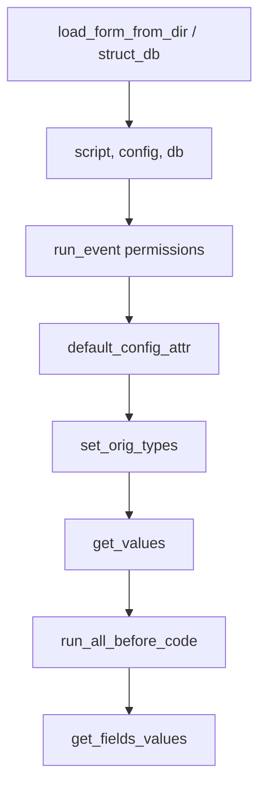

# 16. Обработка типов полей бэкендом

Эта страница — «внутренняя кухня»: что бэкенд делает с каждым `type` на всех
этапах. Каталог типов с примерами — [04-field-types.md](04-field-types.md),
атрибуты — [03-fields-common.md](03-fields-common.md).

## Конвейер `read_config`



- `lib/all_configs.py:read_config` — порядок вызова.
- `lib/CRM/form/set_orig_types.py` — нормализация типов (см. ниже).
- `lib/CRM/form/default_config_attr.py` — `read_only`, `make_delete`,
  `make_create`, `work_table`.

## `orig_type` — что это

`set_orig_types.py:25`:

```python
if T in ('filter_extend_select_from_table', 'filter_extend_select_values',
         'select_from_table', 'select_values'):
    f['orig_type'] = f['type']
    if form.script == 'edit_form':
        f['type'] = 'select'
```

Итого:

- `orig_type` выставляется **только** для четырёх «select-подобных» типов;
- `type` подменяется на `select` **только в `edit_form`**;
- `orig_type` потом используется при выводе значения в списке
  (`routes/get_result/process_result_list.py:60`) и при вырезании полей из
  карточки (`routes/edit_form/process_edit_form.py:55`).

> Ключевой момент: «вырезаются из карточки» только те поля, у которых
> `orig_type` начинается на `filter_extend_`. Для `filter_extend_text`,
> `filter_extend_checkbox`, `filter_extend_switch`, `filter_extend_date`,
> `filter_extend_datetime` `orig_type` **не** проставляется — они остаются в
> `form.fields` (подробнее — [19-known-gaps.md](19-known-gaps.md) и
> [field-types/filter_extend.md](field-types/filter_extend.md)).

## `is_wt_field` — что сохраняется в `work_table`

`lib/core.py:165-175` — белый список типов, которые пишутся в основную таблицу:

```python
['text','textarea','hidden','wysiwyg','select_from_table','select_values',
 'checkbox','switch','date','time','datetime','yearmon','daymon',
 'font-awesome','file','codelist']
```

`1_to_m`, `multiconnect`, `memo`, `in_ext_url`, `1_to_1_*` сохраняются
отдельными механизмами (`save_form.py:update_1_to_1`, `multiconnect_save`,
`save_in_ext_url`); `password` — только при `insert`.

## Матрица: `type` × этап

| `type` | `/get-filters` | WHERE (поиск) | edit-form | `/get-result` | сохранение |
|---|---|---|---|---|---|
| `text` | → `text` | `LIKE %s` (или `=` при `filter_type='eq'`) | как есть | html | `is_wt_field` |
| `textarea` | → `text` | `LIKE` | как есть | html | `is_wt_field` |
| `wysiwyg` | без конвертации | общая ветка | как есть | html | `is_wt_field` |
| `checkbox` / `switch` | без конвертации (фронт делает select да/нет) | `=0` / `=1` | как есть | `да`/`нет` | пусто → `'0'` |
| `select_values` | → `select` | `IN (...)` по `wt.db_name` | → `select`, `orig_type` | подпись из `values` | пусто → `'0'` |
| `select_from_table` | → `select` | `IN` по `wt.db_name` | → `select`, `orig_type` | `header_field`/`value_field` | пусто → `'0'` |
| `date` / `datetime` | `range=1` | диапазон `>=`/`<=` | как есть | `date_to_rus` | спец. формат |
| `time` | `range=1` | общая ветка | как есть | строка | пусто → `'00:00:00'` |
| `daymon` / `yearmon` | `range=1` | общая ветка | как есть | html | `is_wt_field` |
| `hidden` | пропускается | общая ветка | отдаётся | html | `is_wt_field` |
| `font-awesome` | без конвертации | общая ветка | как есть | ветка `startswith('font')` | `is_wt_field` |
| `file` | без конвертации | `<>""` (1) / `=""` (2) | превью resize | ссылка | `is_wt_field` |
| `password` | пропускается | — | значение вырезано, есть генерация | `[пароль зашифрован]` | только `insert`, `mysql_sha2`/`mysql_encrypt` |
| `code` | пропускается | — | вызывает `code(form, field)` | html | нет |
| `codelist` | без конвертации | общая ветка | как есть | html | `is_wt_field` |
| `1_to_m` | пропускается | исключён из сортировки | отдаётся | html/value | отдельный механизм |
| `1_to_1_*` | — | — | отдаётся | html | `update_1_to_1` (только wysiwyg/text/textarea/checkbox/switch) |
| `multiconnect` | как есть | `relation_table_id IN (...)` | отдаётся | `group_concat` | `multiconnect_save` |
| `multiconnect_old` | пропускается | — | да (чекбоксы) | строка | `is_wt_field` (строка `;key;`) |
| `memo` | тянет `users` из `auth_table` | дата/текст/автор | отдаётся | `type=memo` | не сохраняется |
| `in_ext_url` | без конвертации | сортировка по `in_ext_url.ext_url` | отдаётся | `in_ext_url__ext_url` | `save_in_ext_url` |
| `filter_extend_text` | → `text` | `LIKE` | **не вырезается** (см. gaps) | html | — |
| `filter_extend_select_values` | → `select` | `IN` по `wt.db_name` | вырезается (`orig_type`) | подпись из `values` | — |
| `filter_extend_select_from_table` | → `select` | `IN` по `table.db_name` | вырезается (`orig_type`) | `header_field` | — |
| `filter_extend_date` | → `date` | диапазон | **не вырезается** | html | — |
| `filter_extend_datetime` | без конвертации | диапазон | **не вырезается** | нет ветки | — |
| `filter_extend_checkbox` / `filter_extend_switch` | **без конвертации** | `table.db_name=0/1` | **не вырезается** | `да`/`нет` | — |
| `filter_extend_time` | без конвертации | общая ветка | — | строка | — |

Ключевые файлы матрицы:

- `routes/get_filters_routes.py:41-78` — конвертация типов для фильтров,
  удаление служебных ключей.
- `lib/CRM/form/get_search_where.py` — построение `WHERE` (все ветки по
  `f['type']`).
- `routes/edit_form/process_edit_form.py:53-58` — вырезание `filter_extend_*`.
- `routes/get_result/process_result_list.py:60-164` — вывод значения в списке.
- `lib/CRM/form/save_form.py` — сохранение (`update_1_to_1`, `IUD`,
  `multiconnect_save`, `save_in_ext_url`, шифрование пароля).

## `select_from_table` — как получаются значения

`lib/CRM/form/get_values_for_select_from_table.py`:

- `table` — источник (по умолчанию — `name`, если не указано);
- `header_field` (по умолчанию `header`) — подпись;
- `value_field` (по умолчанию `id`) — значение;
- `where`, `order`, `query`, `list`, `tree_use`, `autocomplete`;
- при `autocomplete` и отсутствии `value` возвращается пустой список —
  значения подгружаются через `/autocomplete/<config>`.

## `QUERY_SEARCH_TABLES` (JOIN-ы)

`lib/CRM/form/get_search_tables.py:20-81` собирает `JOIN`/картезиан для списка:

| Короткий | Длинный | Смысл |
|---|---|---|
| `t` | `table` | таблица |
| `a` | `alias` | алиас |
| `l` | `link` | условие `ON` |
| `lj` | `left_join` | `LEFT JOIN` |
| — | `for_fields` | подключать только если эти поля в фильтре |
| — | `select_fields` | брать в SELECT только эти колонки |
| — | `not_add_in_select_fields` | не добавлять колонки в SELECT |

Алиас поля (`tablename`) обязан совпадать с `alias` — иначе фильтр/сортировка
не найдут колонку. `db_name` у `filter_extend_*` — это SQL-выражение по алиасу.

## Пример-разбор: «Домен у нас»

```python
# project/__init__.py
'QUERY_SEARCH_TABLES': [
  {'t':'project','a':'wt'},
  {'t':'domain','a':'d','l':'d.project_id=wt.project_id','lj':1},
],
'fields': [
  # фильтр по домену (смежная таблица d), фильтр-строка
  {'description':'Домен','type':'filter_extend_text','name':'domain',
   'tablename':'d','db_name':'domain','filter_on':True},

  # булев фильтр по домену, в карточку НЕ выводится
  {'description':'Домен у нас','type':'filter_extend_checkbox','name':'our_domain',
   'tablename':'d','db_name':'our_domain'},
],
```

- `filter_extend_text` строит `d.domain LIKE %s`.
- `filter_extend_checkbox` строит `d.our_domain=0/1`.
- Оба не пишутся в `work_table` — это не поля карточки.

## См. также

- [field-types/filter_extend.md](field-types/filter_extend.md) — подробно про
  фильтры по JOIN.
- [10-lists-filters.md](10-lists-filters.md) — списки целиком.
- [19-known-gaps.md](19-known-gaps.md) — расхождения кода и документации.
