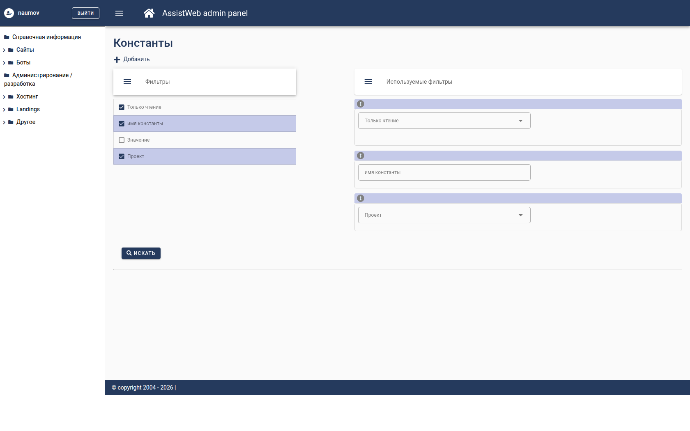
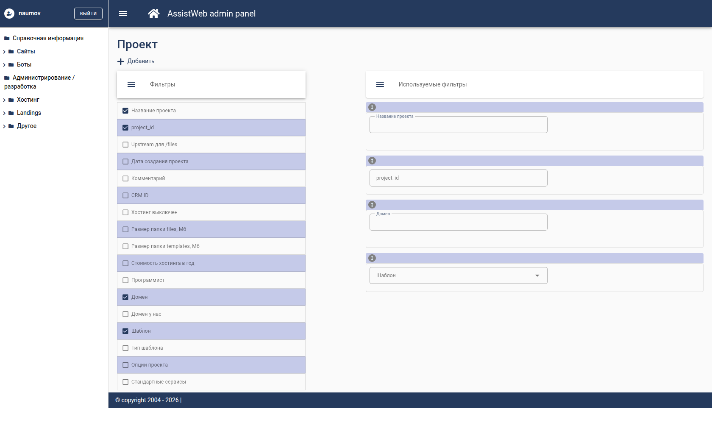
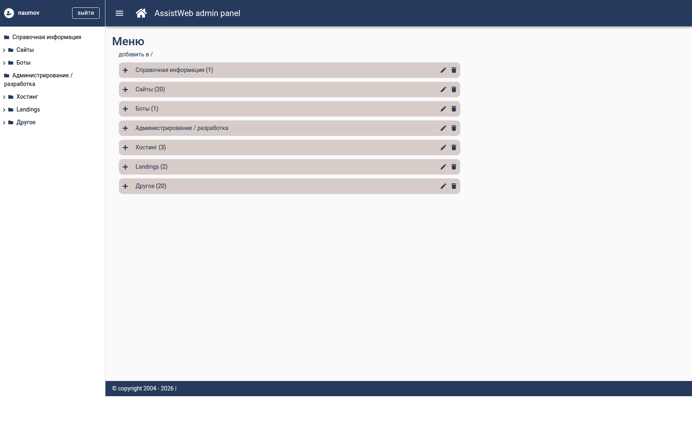
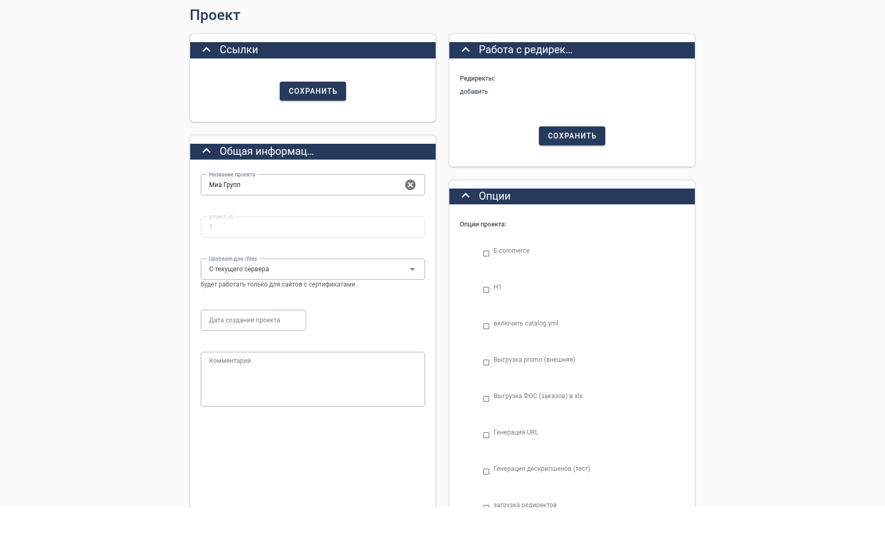
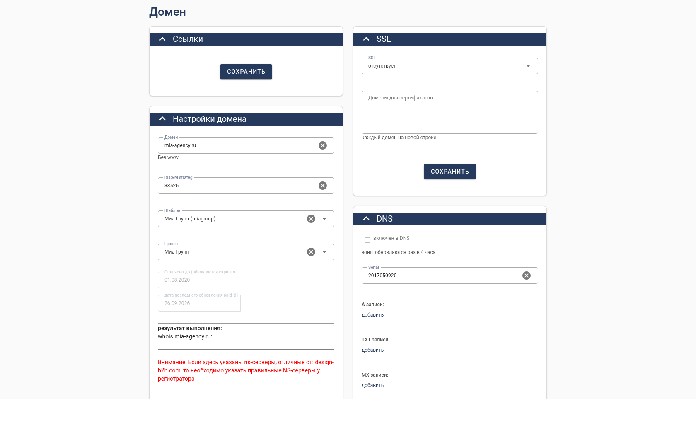
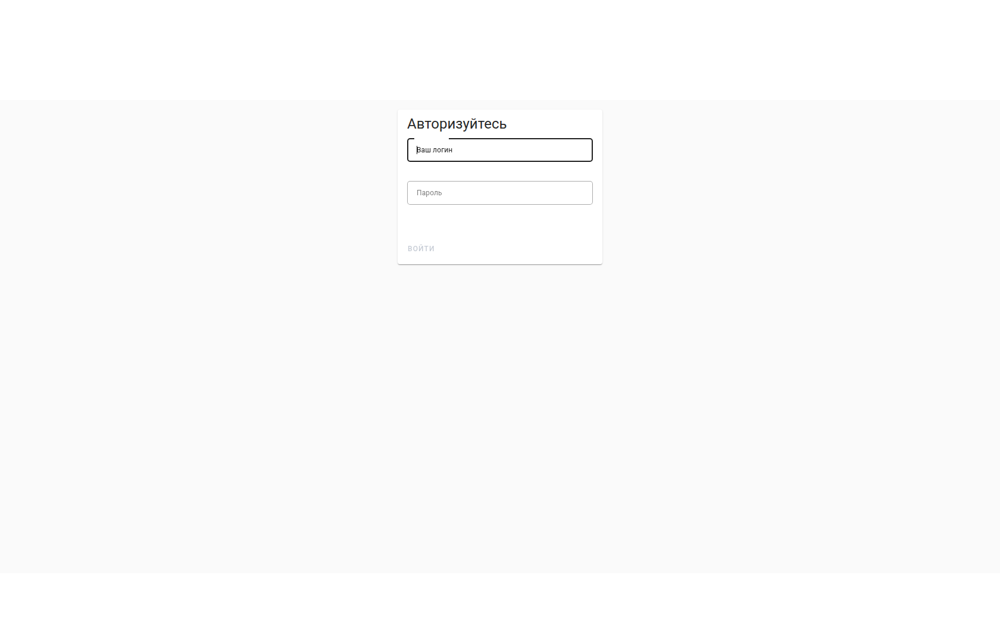

# 17. Контракт с фронтендом

Бэкенд — «всего лишь» источник JSON; из конфига фронт рисует один из
инструментов: **AdminTable** (список), **AdminTree** (дерево/галерея),
**EditForm** (карточка), **Const** (константы). Никакие фоновые скрипты в
конфиге не описываются — конфиг это схема администрируемой таблицы.

Фронтенд: репозиторий `~/projects/CrmFreshFront` (Vue 3 + Vite + Vuetify 3).
Меню (`LeftMenu`) отдаёт пункты, маршрутизатор выбирает компонент по `value`.

## Левое меню

`GET {BackendBase}<left_menu_controller>` → `{left_menu:[...], success}`.

Пункт меню:

```json
{
  "header": "Проекты",
  "type": "vue",
  "value": "admin-table",
  "params": {"config": "project"},
  "icon": "fas fa-cubes",
  "child": []
}
```

| `type`/`value` | Куда ведёт |
|---|---|
| `vue` + `admin-table` | `/vue/admin_table/<params.config>` → `AdminTable.vue` |
| `vue` + `admin-tree` | `/vue/admin_tree/<params.config>` → `AdminTree.vue` |
| `vue` + `const` | `/vue/const/<params.config>` → `Const.vue` |
| `src` | подгружает произвольную страницу |
| `newtab` | открывает URL в новой вкладке |

См. `src/App.vue`, `src/LeftMenu.vue`, `src/components/left_menu_item.vue`.

## AdminTable (список)

1. `POST /get-filters/<config>` — заголовок, `filters`, `permissions`,
   `search_plugin`, `log`, `errors`.
2. `POST /get-result` `{config, query, params}` — `results` (заголовки + строки).
3. Рендер фильтров: `src/components/AdminTable/OnFilters.vue`.

Бэкенд: `routes/get_filters_routes.py`, `routes/get_result_routes.py`,
`routes/get_result/process_result_list.py`.

Особенности фронта (`AdminTable.vue:333-341`): фильтр `checkbox`/`switch` без
`values` превращается в `select` с вариантами «Не использовать/Да/Нет».

## AdminTree (дерево/галерея)

`GET`/`POST /admin-tree/<config>` → `{form, tree, log, errors}`.

`form.*`: `title`, `config`, `header_field`, `tree_use`, `sort`, `sort_field`,
`max_level`, `not_create`, `read_only`, `make_delete`, `changed_in_tree`,
`view_type` (`gallery`), `cols`, `wide_form`, `card_format`.
`item.*`: `id`, `header`, `sort`, `childs`, `photo`.

Действия (POST): `add_branch_plain`, `delete_branch`, `move`, `sort`,
`get_branch`, `load_many_childs`.

Бэкенд: `routes/admin_tree_routes.py`, `routes/admin_tree/admin_tree_run.py`.
См. `src/components/AdminTree.vue`, `AdminTree/branch.vue`, `FormInBranch.vue`.

> Для дерева нужны колонки `parent_id` (иерархия) и, если используется
> `tree_use`, — `path`; сортировка — колонка из `sort_field`.

## EditForm (карточка)

`POST /edit-form/<config>` (new) и `/edit-form/<config>/<id>` (edit).
Фронт `src/components/EditForm.vue` + `EditForm/FormBlock.vue` выбирает
компонент поля функцией `dynamic_component`.

Поддерживаемые `type` (→ глобальный компонент):

| `type` | компонент |
|---|---|
| `text`, `textarea` | `field-text` |
| `checkbox`, `switch`, `1_to_1_checkbox` | `field-checkbox` |
| `select` (в т.ч. из `select_values`/`select_from_table`) | `field-select` |
| `multiconnect` | `field-multiconnect` |
| `date`, `time`, `datetime`, `yearmon`, `daymon` | `field-<type>` |
| `wysiwyg` | `field-wysiwyg` |
| `password` | `field-password` |
| `code` | `field-code` |
| `memo` | `field-memo` |
| `1_to_m` | `field-1_to_m` |
| `file` | `field-file` |
| `docpack` | `field-docpack` |
| `in_ext_url` | `field-in_ext_url` |
| `time_table` | `field-time_table` |
| `font-awesome` | `field-font-awesome` |
| `component` | `field-component` |
| `accordion` | `field-accordion` |
| `project_sitemap` | `field-project_sitemap` |
| `project_export` | `field-project_export` |
| `project_clone` | `field-project_clone` |
| `project_struct` | `field-project_struct` |

Префикс `1_to_1_` отбрасывается (`field.type.replace('1_to_1_','')`).

> `field-chart` и `field-table` зарегистрированы, но `FormBlock` их не выбирает —
> они работают только внутри `field-accordion`. Для `filter_extend_*` компонента
> нет: `dynamic_component` вернёт `''`, поле в карточке не отрисуется.

## Фильтры списка

`OnFilters.dynamic_component` поддерживает только: `text`, `textarea`,
`wysiwyg` → `filter-text`; `checkbox`, `switch` → `filter-checkbox`
(**не зарегистрирован**, поэтому чекбокс-фильтры заранее превращаются в
`select`); `file`, `select`, `date`, `datetime`, `yearmon`, `memo`,
`in_ext_url`, `multiconnect` → соответствующие `filter-*`.

Типы `filter_extend_*` и `filter-checkbox` на фронте **отсутствуют** — такие
фильтры не отрисуются. Подробности и обходы — [19-known-gaps.md](19-known-gaps.md).

## Const (константы)

`GET`/`POST /const/<config>` (см. `routes/const_routes.py`). Фронт
`src/components/Const.vue` понимает типы `header`, `text`, `textarea`,
`wysiwyg`, `file`, `checkbox`, `switch`, `select`. Сохранение — сразу при
изменении.

## Скрины стенда `config_svcms_admin`

Реальные экраны (фронт `CrmFreshFront`, dev-режим).

**AdminTable:** слева — левое меню из `admin_menu_new`, ниже — фильтры и список:





**AdminTree:** редактор левого меню (`admin_menu`, drag&drop, `parent_id`/`path`):



**EditForm:** проект — колоночная раскладка (`cols`) и `multiconnect`
«Опции проекта»:



**EditForm:** домен — связи `1_to_m` (DNS-записи, шаблон, проект):



**Логин:**


